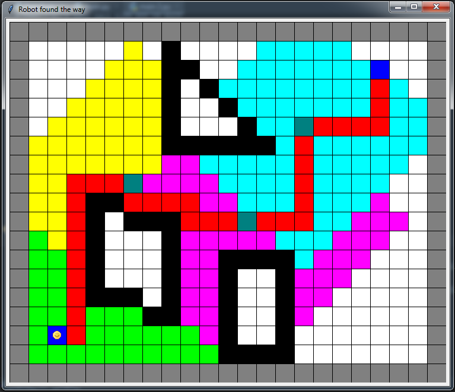
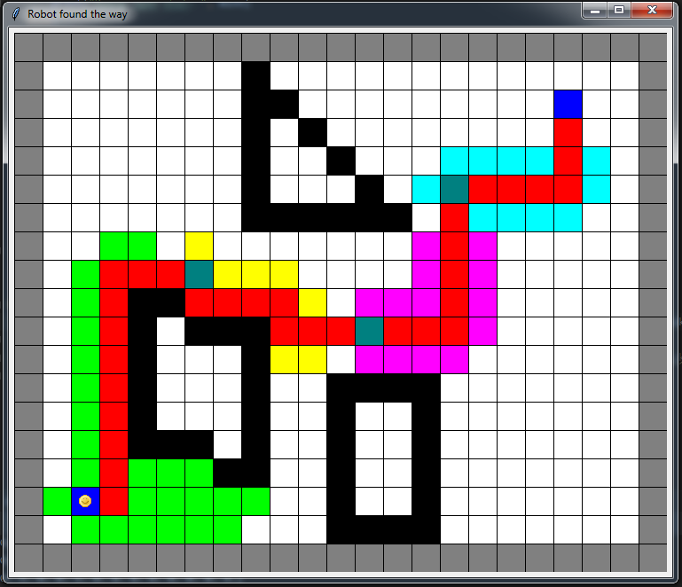
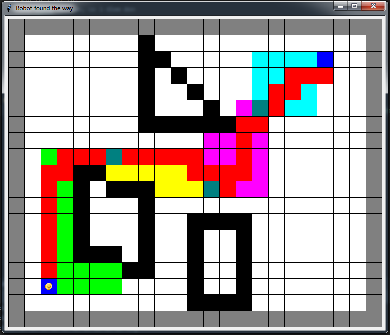

# Robot-Find-Path
The goal is finding a shortest path from the starting point to the goal point. There are obstacle that need to avoid when finding the optimal path way. There are also pick-up points between the starting point and the goal point that our path have to go through. We implement 3 different for this task: Breadth-first search, Greedy Best-first search and A*
## Breadth-first search

## Greedy Best-first

## A*

